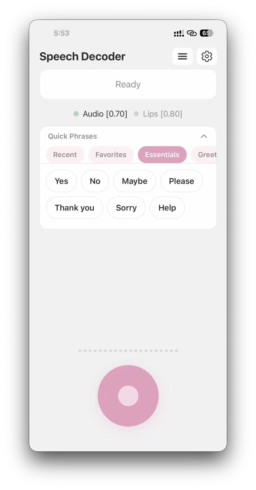

# VoiceLift

Multimodal speech accessibility app that decodes impaired speech using Whisper ASR, lip reading (MediaPipe), and Claude LLM fusion — personalized per user, improving over time without model retraining.




## Overview

Standard speech-to-text fails on impaired speech. A user with dysarthria says "I want to go home" but Whisper hears "I wah go ho." Speech Decoder fixes this by combining three signals:

1. **Whisper ASR** — raw audio transcription (often wrong for impaired speech)
2. **Lip Reading** — MediaPipe Face Mesh tracks 40 lip landmarks on-device, classifying mouth shapes into sequences that are matched against calibration recordings
3. **Claude LLM Fusion** — Claude receives the Whisper output, lip shape matches, and the user's personal error history, then reasons across all signals to produce corrected text

The system builds a personal error profile during calibration and grows it with every user correction. No model retraining needed — Claude uses the profile as prompt context, so accuracy improves per user over time.

**Built for** people with speech impairments (dysarthria, stuttering, apraxia, ALS, cerebral palsy, stroke recovery, vocal cord paralysis) — with accessibility adaptations for users who also have vision impairments.

## Architecture

```
┌──────────────────────────┐                        ┌──────────────────────────┐
│      EXPO APP (Mobile)   │                        │     FASTAPI (Backend)    │
│                          │   REST + WebSocket     │                          │
│  Audio Recording         │ ──────────────────────>│  Whisper ASR             │
│  (expo-av, PCM 16kHz)    │                        │  (OpenAI Whisper API)    │
│                          │                        │                          │
│  Lip Tracking            │   POST /decode/{id}    │  Lip Signature Matching  │
│  (MediaPipe Face Mesh)   │ ──────────────────────>│  (shape sequence compare)│
│                          │                        │                          │
│  Shape Sequence          │                        │  Claude LLM Fusion       │
│  (on-device compression) │                        │  (correction + decode)   │
│                          │   JSON response        │                          │
│  UI: decoded text,       │ <──────────────────────│  User Profile Store      │
│  feedback, calibration   │                        │  (error maps, lip sigs)  │
└──────────────────────────┘                        └──────────────────────────┘
```

## Tech Stack

| Layer | Technology |
|---|---|
| Mobile app | Expo SDK 54, React Native, TypeScript, Expo Router |
| Audio capture | expo-av (PCM 16kHz mono) |
| Lip tracking | MediaPipe Face Mesh (on-device, 40 lip landmarks, 30fps) |
| Text-to-speech | expo-speech (accessibility for vision-impaired users) |
| Backend API | FastAPI (Python 3.10+) |
| Speech-to-text | OpenAI Whisper API |
| LLM fusion | Anthropic Claude API (claude-sonnet-4-5-20250929) |
| Audio processing | pydub, numpy, opencv-python |
| Lip processing | MediaPipe (backend), rule-based shape classification |
| Storage | Local file-based (user profiles + error mappings) |

## How It Works

### 1. Calibration

The user reads a set of known phrases aloud while the front camera tracks lip movements. For each phrase:
- Whisper transcribes the audio
- MediaPipe captures lip landmarks, compressed into a shape sequence (e.g. `CLOSED(80ms) → OPEN_ROUND(200ms)`)
- Mismatches between Whisper output and the known phrase are stored as error mappings
- The lip shape sequence is stored as a lip signature for that phrase

This builds a personal speech profile: what Whisper gets wrong for this user, and what their mouth looks like when saying specific phrases.

### 2. Decode

When the user speaks freely:
- Audio goes to Whisper for raw transcription
- Lip landmarks are captured and the shape sequence is compared against all calibration signatures to find the closest matches
- Modality weights shift based on Whisper confidence (low confidence = trust lips more)
- Claude receives everything — Whisper output, lip matches, error history, modality weights — and outputs corrected text
- If the user has vision impairment, the decoded text is spoken aloud via TTS

### 3. Feedback Loop

After each decode, the user can confirm or correct the result. Corrections create new error mappings that grow the profile. Claude sees more examples with each decode, so accuracy improves without any retraining.

## Project Structure

```
backend/
├── main.py                          # FastAPI app, CORS, route registration
├── requirements.txt
├── app/
│   ├── api/
│   │   ├── calibration.py           # Calibration endpoints
│   │   ├── recognition.py           # Decode endpoint
│   │   ├── correction.py            # Feedback endpoints
│   │   ├── users.py                 # User CRUD
│   │   ├── lip_stream.py            # Lip frame/video analysis
│   │   └── websocket_stream.py      # WebSocket streaming decode
│   ├── services/
│   │   ├── whisper_service.py       # Whisper API integration
│   │   ├── claude_service.py        # Claude API integration
│   │   ├── tts_service.py           # Text-to-speech generation
│   │   └── fusion_service.py        # Multimodal fusion logic
│   ├── models/                      # Pydantic request/response models
│   ├── storage/
│   │   └── file_manager.py          # File-based user profile storage
│   ├── config/
│   │   ├── settings.py              # Environment variable config
│   │   └── prompts.py               # Claude prompt templates
│   └── utils/                       # Audio + text utilities
└── users/{user_id}/                 # Per-user profile + correction data

mobile/
├── app/
│   ├── _layout.tsx                  # Root layout + navigation
│   ├── index.tsx                    # Entry router
│   ├── onboarding.tsx               # First-time setup
│   ├── calibration.tsx              # Guided phrase recording
│   ├── speak.tsx                    # Main decode screen
│   ├── history.tsx                  # Past decoded utterances
│   └── settings.tsx                 # Profile + modality toggles
├── components/                      # UI components (SpeakButton, FeedbackBar, etc.)
├── hooks/                           # useAudioRecorder, useLipTracker, useCalibration, etc.
├── services/                        # API client, WebSocket client, AsyncStorage
├── utils/                           # Audio, landmarks, shapes, constants
└── types/                           # Shared TypeScript interfaces
```

## Setup

### Prerequisites

- Python 3.10+
- Node.js 18+
- Expo CLI (`npm install -g expo-cli`)
- ffmpeg (`brew install ffmpeg` on macOS, `winget install ffmpeg` on Windows)

### Backend

```bash
cd backend
python -m venv venv
source venv/bin/activate        # Windows: venv\Scripts\activate
pip install -r requirements.txt
```

Create `backend/.env`:
```
WHISPER_API_KEY=sk-your-openai-key
CLAUDE_API_KEY=sk-ant-your-anthropic-key
```

Run the server:
```bash
uvicorn main:app --reload --host 0.0.0.0 --port 8000
```

### Mobile

```bash
cd mobile
npm install
```

Set the backend URL in your environment (the mobile app reads `EXPO_PUBLIC_API_URL`):
```bash
export EXPO_PUBLIC_API_URL=http://<your-local-ip>:8000
```

Start the Expo dev server:
```bash
npx expo start
```

Scan the QR code with Expo Go on your phone, or press `i` for iOS simulator / `a` for Android emulator.

## API Endpoints

### Users

| Method | Path | Description |
|---|---|---|
| `POST` | `/users` | Create a new user |
| `GET` | `/users/{user_id}` | Get user profile |
| `PATCH` | `/users/{user_id}` | Update user profile |

### Calibration

| Method | Path | Description |
|---|---|---|
| `POST` | `/api/calibrate` | Legacy calibration endpoint |
| `GET` | `/calibration/phrases` | Get calibration phrases |
| `POST` | `/calibration/{user_id}/submit-with-lips` | Submit a phrase with audio + lip data |
| `POST` | `/calibration/{user_id}/complete` | Finalize calibration session |

### Decode

| Method | Path | Description |
|---|---|---|
| `POST` | `/decode/{user_id}` | Decode speech from audio + lip data |
| `WS` | `/decode/{user_id}/stream` | WebSocket streaming decode |

### Feedback

| Method | Path | Description |
|---|---|---|
| `POST` | `/feedback/{user_id}` | Submit confirmation or correction |
| `GET` | `/feedback/{user_id}/history` | Get decode history |

### Lip Processing

| Method | Path | Description |
|---|---|---|
| `GET` | `/api/lips/health` | Lip service health check |
| `POST` | `/api/lips/frame` | Analyze a single frame for lip reading |
| `POST` | `/api/lips/mp4` | Analyze an MP4 video for lip reading |

## Design Decisions

- **File-based storage, no database** — User profiles and error mappings are stored as local files. Simplicity over scalability; appropriate for a prototype with a small number of users.
- **No authentication** — User ID is stored locally on the device. No login flow, no tokens. Keeps the focus on the speech decoding problem.
- **Claude as fusion engine, not content generator** — Claude only decodes user intent from noisy signals. It never generates new content or answers questions on behalf of the user, preserving user agency.
- **Dynamic modality weights** — When Whisper confidence is high (>0.7), audio is weighted 0.85 and lips 0.15. When Whisper confidence drops below 0.4, lips become the primary signal at 0.70. These weights are passed to Claude in the prompt.
- **On-device lip processing** — MediaPipe runs on the phone. Only compressed shape sequences are sent to the backend, reducing bandwidth and latency.
- **Lip shape classification** — 8 discrete mouth shapes (CLOSED, BARELY_OPEN, OPEN_SPREAD, OPEN_ROUND, WIDE_SPREAD, PURSED, NARROW, NEUTRAL) classified from openness, width, and rounding metrics. Simple rule-based approach, no ML model needed.

## Contributors

- Jerome Teoh
- Darren Sim
- Jamison Teng
- Liediana Djoli
- Raphael Lim
