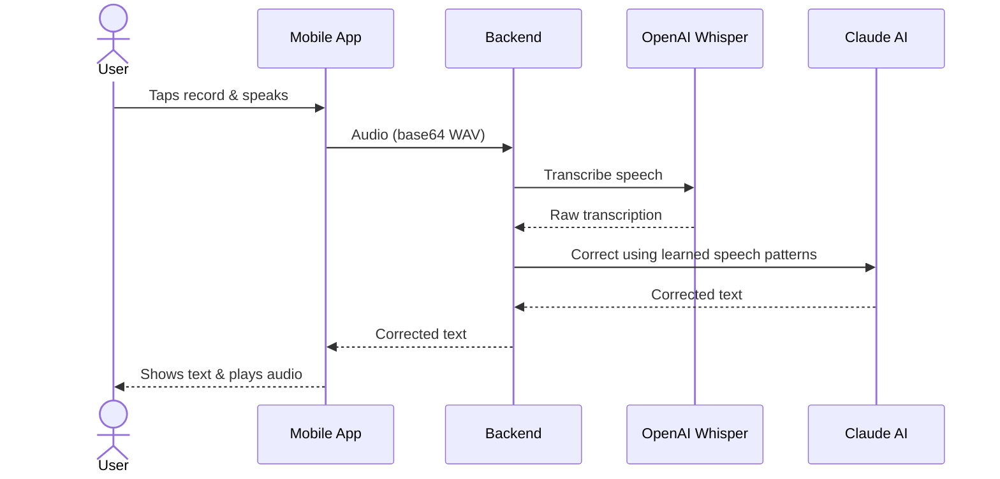

# WIT-2026 - Sigma Tech v10

Multimodal speech accessibility platform that decodes impaired speech using AI-powered pattern learning, multilingual support, and multimodal input fusion.

## Architecture



## Tech Stack

| Layer | Technology |
|-------|-----------|
| Mobile | React Native / Expo |
| Backend | FastAPI (Python 3.10+) |
| Speech-to-Text | OpenAI Whisper API |
| AI Correction | Claude Sonnet 4.5 |
| Text-to-Speech | Expo Speech + Azure TTS |
| Lip Reading | MediaPipe |

## Features

- **Personalized speech decoding** — calibration session learns individual speech patterns and applies corrections in real time
- **Multilingual support** — automatic language detection across supported languages
- **Lip-reading fusion** — combines audio transcription with visual lip-reading data for higher accuracy
- **Calibration learning loop** — users can correct outputs, and the system learns from each correction
- **Accessibility modes** — vision impairment support with large text, high contrast, and TTS audio output

## Quick Start

### Backend

```bash
cd backend
python -m venv venv
source venv/bin/activate  # Windows: venv\Scripts\activate
pip install -r requirements.txt
```

Create `backend/.env`:
```
WHISPER_API_KEY=sk-your-openai-key
CLAUDE_API_KEY=sk-ant-your-anthropic-key
```

```bash
uvicorn main:app --reload
```

### Mobile

```bash
cd mobile
npm install
npx expo start
```

## Contributors

- Jerome Teoh
- Darren Sim
- Jamison Teng
- Liediana Djoli
- Raphael Lim
